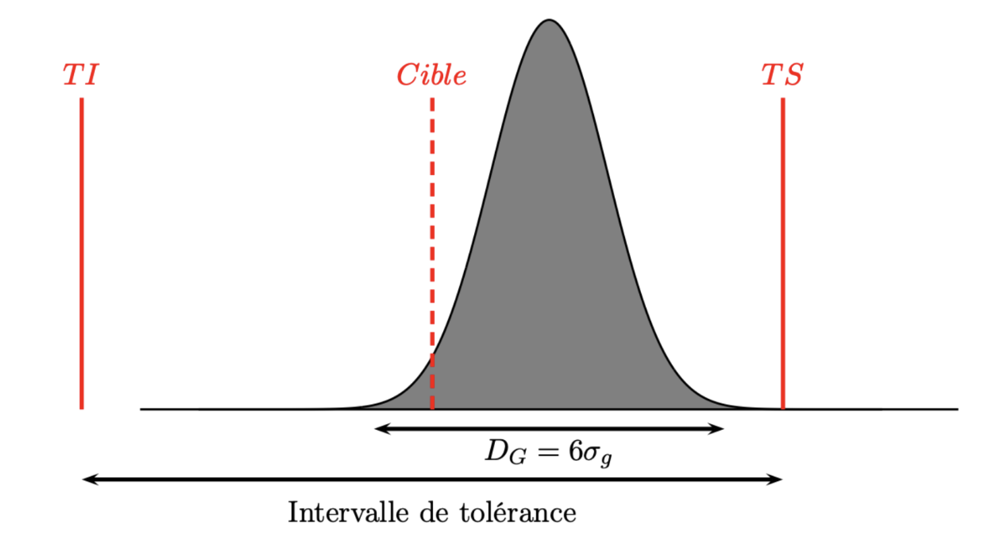

# Capabilité, Répétabilité, Reproductivité

## Capabilité d'un procédé de fabrication :

Dans la suite $TS,TI$ désigneront la tolérance supérieure et inférieure du procédé de fabrication.

Comme précédemment on distingue la variabilité globale du procédé et celle uniquement attribuable à la machine.

On définit deux types d'indices de capabilité :

::: {.callout-note title="Capabilité"}
-   La capabilité globale du procédé de fabrication (appelée aussi coefficient d'aptitude du procédé) est $$
    Cap=\frac{TS-TI}{D_G}.
    $$
-   La capabilité machine (appelée aussi coefficient d'aptitude du moyen)

$$
Cam=\frac{TS-TI}{D_I}.
$$
:::

Il est clair que lorsque $Cap<1$ le procédé n'est pas capable, il faut le revoir afin d'obtenir une production conforme aux tolérances. Par contre si $Cap>2$ on va considérer que le procédé est capable dans la mesure où la dispersion naturelle des observation est 2 fois moins importante que l'intervalle de tolérance.

Les deux indicateurs précédents ont un gros inconvénient dans la mesure où ils ne permettent pas de juger du décentrage éventuel du procédé. Par exemple, dans le cas d'une loi normale, on peut avoir une situation comme celle ci-dessous :



On voit que le procédé est bien dans l'intervalle de tolérance avec une valeur $Cap>2$ mais qu'il est clairement décentré. Donc il faut définir de nouveaux indices de capabilité qui vont permettre de juger de la justesse du procédé !

::: {.callout-note title="Capabilité (version 2)"}
Le coefficient de performance du procédé est

$$
Cpk=\frac{\min\left(\mu-TI;TS-\mu\right)}{3\sigma_{G}},
$$ et celui la machine est $$
Cmk=\frac{\min\left(\mu-TI;TS-\mu\right)}{3\sigma_{I}}.
$$
:::

Il est clair que l'on a :

1.  $Cap>Cpk,$

2.  $Cam>Cmk.$

On utilisera la norme suivante :

***Un procédé (respectivement une machine) est capable si*** $Cpk>1.33$ (respectivement $Cmk>1.33$)

### Intervalles de confiance

Les calculs de $Cap$ et de $Cpk$ sont basés sur des estimations de l'écart type $\sigma_G$. Dans le cas d'une loi normale on sait construire un intervalle de confiance de $\sigma_G$, on en déduit que

1.  L'intervalle $\left[\widehat C_{ap}\sqrt{\dfrac{\chi^2_{n-1}(\alpha/2)}{n-1}};\widehat C_{ap}\sqrt{\dfrac{\chi^2_{n-1}(1-\alpha/2)}{n-1}}\right]$ est un intervalle de confiance de $Cap$ au niveau de confiance $100(1-\alpha)$ %.

2.  L'intervalle $\left[\widehat C_{pk}\left(1-z_{1-\alpha/2}\sqrt{\dfrac{1}{9n\widehat C_{pk}^2}+\dfrac{1}{2(n-1)}}\right);\widehat C_{pk}\left( 1+z_{1-\alpha/2}\sqrt{\dfrac{1}{9n\widehat C_{pk}^2}+\dfrac{1}{2(n-1)}}\right)\right]$ est un intervalle de confiance de $C_{pk}$ au niveau de confiance $100(1-\alpha)$ %.

De même pour $C_{am},C_{mk}$

### Fin de l'exemple

On suppose que les tolérance sont $TI=0.9$ et $TS=1.1$. En utilisant la fonction ***capability*** du package multiSPC calculer les indices de capabilité associés à ce procédé de fabrication.

```{r eval=F}
#| code-fold: true
#| code-summary: "Voir la correction"
library(multiSPC)
df<-read.csv("cap_data.csv",sep=",")
mu=mean(df$obs)
sG=sd(df$obs)
sI=df|> group_by(sample) |> summarise(S=sd(obs)) |> select(S) |>unlist() |> mean()/c4(5)
capability(n=5,mu=mu,sI=sI,sG=sG,TI=0.9,TS=1.1)
```

## Analyse de la qualité d'une mesure

Cette étape de vérification est indispensable dans tout système de contrôle de qualité.

Une mesure doit être répétable et reproductible (R&R).

### R&R

::: {.callout-note title="Répétabilité"}
La répétabilité désigne la capacité d'un processus, d'un instrument de mesure ou d'une expérience à produire des résultats identiques ou très proches lorsque les mêmes conditions (même opérateur, même équipement, ...) sont appliquées plusieurs fois de suite sur une courte période.
:::

La répétabilité est donc intrinsèquement liée à la qualité fournie par un instrument de mesure. On pourra vérifier que les spécifications de l'instrument sont bien conformes à des mesures effectuées in situ.

::: {.callout-note title="Reproductibilité"}
La reproductibilité désigne la capacité d'un processus, d'une expérience ou d'une mesure à produire des résultats similaires lorsqu'il est réalisé par des personnes différentes, dans des lieux différents, avec des équipements différents, ou à des moments différents.
:::

Dans un système complet à l'erreur de la mesure proprement dite (R&R), s'ajoute la variabilité liée au produit :

$$
\sigma_{Total}^2=\underbrace{\sigma_{repetability}^2+\sigma_{reproductivity}^2}_{\sigma^2_{R\& R}}+\sigma_{product}^2.
$$

::: {.callout-note title="Rappel ANOVA"}
On considère $I$ produits, $J$ opérateurs et chaque mesure est repétée $K$ fois Pour évaluer la répétabilité et la reproductibilité d'une mesure, on utilise un modèle d'ANOVA : Soit $Y_{ijk}$ la mesure du produit $i$ par l'opérateur $j$ à la répétition $k$.\
On écrit $$
Y_{ijk}=\mu+\alpha_i+\beta_j+\varepsilon_{ijk}
$$ où on considère que $\varepsilon_{ijk}\sim \mathcal N(0,\sigma^2)$.

Les paramètres de ce modèle permettent d'évaluer l'ensemble des composantes de la variabilité totale de la mesure:

-   $(\alpha_i)_i$ pour la variabilité produit,

-   $(\beta_j)_j$ pour la reproductibilité,

-   $\sigma^2$ pour la répétabilité
:::

***Exemple :*** On cherche à détecter les sources de variabilité d'une analyse par qPCR La réponse de la mesure dépend de la quantité d'ADN recherchée dans l'échantillon de départ.

-   4 espèces différentes de mycoplasmes sont étudiées.

-   2 opérateurs ont réalisé les mesures, sur 2 jours distincts, avec 4 répétitions à chaque fois. Les données sont disponibles [ici](ex_qPCR.csv).

```{r echo=F}
data=read.csv("ex_qPCR.csv",sep=";")
library(gt)
gt_preview(data)
```

Dans cet exemple on va pouvoir évaluer la variabilité due au produit, à l'opérateur, au jour grâce à une Anova :

```{r}
options(contrasts=c("contr.sum","contr.sum"))
model <- lm(reponse ~ souche+operateur+jour, data = data)
anova(model)
```

On peut ainsi étudier :

-   L'effet souche ($F(3,58)=70.5,p<.001$) qui est significatif, l'effet opérateur ($F(1,58)=8.5,p=.005$) qui est également significatif et l'effet jour ($F(1,58)=0.02,p=.90$) qui ne l'est pas.

-   La variabilité associée au jour qui est une composante de la reproductibilité n'est pas considérée par la suite car très proche de 0.

-   Le résidu correspond à la répétabilité de la mesure.

::: {.callout-note title="Rappel ANOVA à effets aléatoires"}
Pour évaluer la part de chaque composante de la variabilité on écrit $$
Y_{ijk}=\mu+\alpha_i+\beta_j+\varepsilon_{ijk}
$$

où on suppose que :

-   $\alpha_i\sim \mathcal N(0,\sigma^2_\alpha)$ ($\sigma^2_\alpha$ : variabilité produit),

-   $\beta_j\sim \mathcal N(0,\sigma^2_\beta)$ ($\sigma^2_\beta$ : reproductibilité),

-   $\varepsilon_{ijk}\sim \mathcal N(0,\sigma^2)$ ($\sigma^2$ : répétabilité).
:::

Dans R, l'Anova à effets aléatoires :

```{r echo=T}
library(lmerTest)
model <- lmer(reponse ~ 1 + (1|souche) + (1|operateur) , data = data)
vc <- as.data.frame(VarCorr(model))$vcov
names(vc)=as.data.frame(VarCorr(model))$grp
df=data.frame(variance=c(vc,sum(vc)),"per_var"=c(vc/sum(vc)*100,100))
rownames(df)=c("Part","reproductibiliy","repetebility","Total")
```

```{r echo=F}
gt(df,rownames_to_stub = T)|>fmt_number(decimals = 2)
RR=sum(df$per_var[2:3])
print(RR)
```

::: {.callout-note title="Interprétation %RR"}
On utilise les références suivantes :

-   Si %RR \< 10%, alors la mesure est répétable et reproductible,
-   Si %RR est compris entre 10% et 30% alors la mesure est acceptable,
-   Au delà de 30% il faut revoir le processus.
:::

Donc ici la mesure est acceptable.

### Capabilité d'un instrument de mesure.

Il est évalué comme précédemment en considérant les tolérances inférieures et supérieures imposées par le client :

::: {.callout-note title="Capabilité instrument de mesure"}
-   Coefficient de capabilité d'un moyen de contrôle : $$
    Cmc=\frac{TS-TI}{6\sigma_{R\&R}},
    $$ on doit avoir $Cmc>4$.
:::
