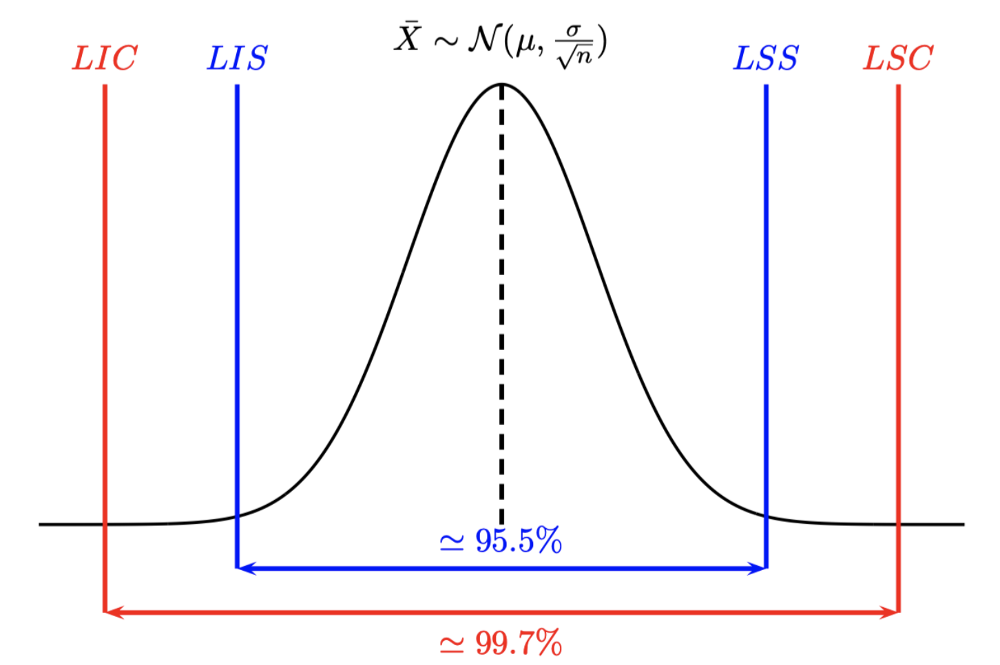

# Cartes de contrôle

```{r echo=F, warning=FALSE}
knitr::opts_chunk$set(echo = TRUE)
suppressPackageStartupMessages(
  {
  library(tidyverse)
library(ggplot2)
library(knitr)
library(multiSPC)
library(readxl)
  }
)
```

## Historique

-   Inventées par Walter A. Shewhart (années 1920)

-   S'utilisent dans de très nombreux secteurs d'activité (industrie, transport, service, ...)

-   Suivi et/ou amélioration d'un système de production

**Avantages**

-   Très faciles à mettre en oeuvre

-   Très faciles à interpréter (graphiques)

**Inconvénients**

-   Ne tient pas a priori compte des tolérances

-   N'est pas toujours efficace (ex : si problème de déviation progressive)

## Comprendre les variations des procédés de fabrication

On distingue plusieurs causes qui peuvent induire des variations dans un système de production :

-   ***causes aléatoires*** (communes) elles sont en grand nombre avec un effet individuel faible. On peut les modéliser par une variable aléatoire (en général gaussienne). Elles peuvent être corrigées par des actions sur le système global. Exemple : temps de trajet domicile-travail. Si il y a des feux rouges sur le trajet ceux-ci pourront être parfois verts ou rouges, il peut y avoir plus ou moins de circulation... Action globale : changer de route pour ne plus avoir de feux rouges !

-   ***causes assignables*** (spéciales) elles sont rares et ne peuvent pas être associées directement au procédé de fabrication (Deming 1986). Elles peuvent être corrigées par des actions locales. Exemple : un accident de la route se produit sur le trajet.

Un processus est dit ***sous contrôle ou statistiquement stable*** lorsque les variations sont uniquement dûes à des causes aléatoires.


## Cartes de position et de dispersion


***Exemple***

Suivi de production journalière de steacks hachés surgelés durant 12h de production. Chaque heure on prélève 5 steaks et on les pèse.

Les données sont disponibles [ici](exemple_carte_Shewhart.csv)

```{r echo=F}
data<-read.csv("exemple_carte_Shewhart.csv")
kable(head(data))
```

On va construire les cartes de contrôle données ci-dessous

```{r warning=FALSE, echo=F}
df<-data[,-1]
n=ncol(df)
M=apply(df,1,mean)
S=apply(df,1,sd)
mu=mean(M)
sigI=mean(S)/c4(n)
LICm=mu-3*sigI/sqrt(n)
LSCm=mu+3*sigI/sqrt(n)
LICs=mean(S)-3*mean(S)*sqrt(1-c4(n)^2)/c4(n)
LSCs=mean(S)+3*mean(S)*sqrt(1-c4(n)^2)/c4(n)
plot_chart(M,LIC=LICm,LSC=LSCm,Type = "carte de la moyenne")
plot_chart(S,LIC=LICs,LSC=LSCs,Type = "carte de l'écart type")
```

Pour chaque échantillon de 5 steacks on calcule la moyenne et l'écart type et on les reporte sur les cartes correspondantes.

### Distribution des paramètres

On suppose que tous les paramètres suivent une loi normale.

-   La moyenne d'un échantillon $\bar Y \sim \mathcal N(\mu,\frac{\sigma}{\sqrt n}).$

-   L'étendue d'un échantillon $R \sim \mathcal N(\mu_R,\sigma_R).$

-   L'écart type d'un échantillon $S \sim \mathcal N(\mu_S,\sigma_S).$

On définit alors les limites de surveillance et de contrôle pour chaque carte. Pour la carte de la moyenne :

 On se fixe un risque $\alpha$ de stoper la production alors que celle-ci est sous contrôle (***Fausses alertes***). On cherche donc un intervalle de confiance $1-\alpha$ de $\bar X$ La distribution des moyennes étant normale on a

$$
\begin{cases}
LI=\mu-z_{1-\alpha/2}\frac{\sigma}{\sqrt n} \\
LS=\mu+z_{1-\alpha/2}\frac{\sigma}{\sqrt n} \\
\mathbb P(LI<\bar X<LS)=1-\alpha
\end{cases}
$$

On pourra en conclure que la moyenne $\bar X$ de l'échantillon considéré n'est pas significativement différente de la moyenne $\mu$ (c'est à dire que le procédé est sous contrôle) si $\bar X \in [LI,LS].$

Les ***limites de surveillance*** sont définies de façon à déterminer, au risque de 4.5%, les moyennes significativement différentes de la moyenne globale :

-   Limite inférieure de surveillance (LIS): $LIS=\mu-2\frac{\sigma}{\sqrt n}$

-   Limite supérieure de surveillance (LSS): $LSS=\mu+2\frac{\sigma}{\sqrt n}$

Les ***limites de contrôle*** sont définies de façon à déterminer, au risque de 0.3% de fausses alertes, les moyennes significativement différentes de la moyenne globale :

-   Limite inférieure de contrôle (LIC): $LIC=\mu-3\frac{\sigma}{\sqrt n}$

-   Limite supérieure de contrôle (LSC): $LSC=\mu+3\frac{\sigma}{\sqrt n}$

::: {.callout-note title="Limites des cartes de contrôle"}
On a prélevé à intervalles réguliers $k$ échantillons de $n$ observations. On a calculé $\bar y_j,R_j$ la moyenne et l'étendue de chacun des $k$ échantillons.

Pour construire :

-   La carte de la moyenne on utilise $\hat \mu_I=\frac 1{k} \displaystyle\sum_{j=1}^k \bar y_{j}$ et $\hat \sigma_I = \dfrac{\bar R}{d_2}$.

-   La carte de l'étendue on utilise $\hat\mu_R=\bar R$ et $\hat \sigma_R=\frac{d_3}{d_2}\bar R$.

-   La carte de l'écart type on utilise $\hat\mu_S=\bar S$ et $\hat \sigma_S=\frac{\sqrt{1-c_4^2}}{c_4}\bar S$.
:::

### Retour sur l'exemple :

1.  Calculer les limites de contrôles des cartes de la moyenne et de l'écart type en utilisant les 10 premiers prélèvements. Construire les cartes et vérifier qu'il n'y a pas de points hors limites

2.  Construire les cartes correspondantes aux 14 autres prélèvements, on utilisera les limites précédentes.


### Correction

```{r}
#| code-fold: true
#| code-summary: "Voir la correction"

k=nrow(df)
n=ncol(df)
train=df[1:10,]
M=apply(train,1,mean)
S=apply(train,1,sd)
mu=mean(M)
sigI=mean(S)/c4(n)
LICm=mu-3*sigI/sqrt(n)
LSCm=mu+3*sigI/sqrt(n)
LICs=mean(S)-3*mean(S)*sqrt(1-c4(n)^2)/c4(n)
LSCs=mean(S)+3*mean(S)*sqrt(1-c4(n)^2)/c4(n)
plot_chart(M,LIC=LICm,LSC=LSCm,Type = "carte de la moyenne")
plot_chart(S,LIC=LICs,LSC=LSCs,Type = "carte de l'écart type")


test=df[11:24,]
Mt=apply(test,1,mean)
St=apply(test,1,sd)
plot_chart(M,LIC=LICm,LSC=LSCm,Type = "carte de la moyenne")
plot_chart(S,LIC=LICs,LSC=LSCs,Type = "carte de l'écart type")

```
